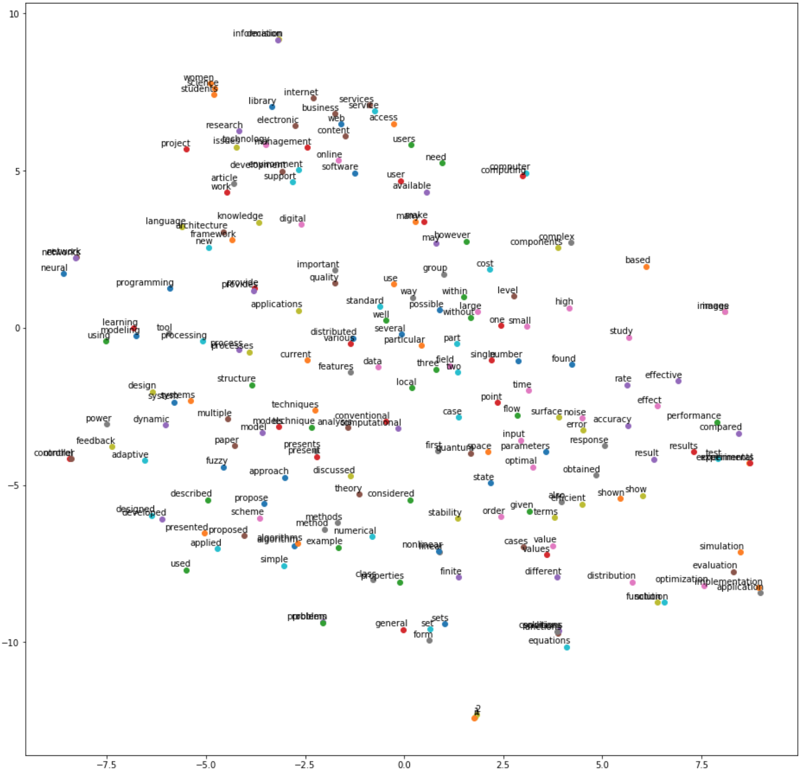

# fastTextRank: using fastText subword embedding model to remove duplicate key phrases with morphological variations

## Motivation
Keyword/phrase extraction is an important task for information retrieval, text categorization, text summarization and other
various tasks. Currently, unsupervised graph-based methods have been widely used and showed promising results.

Recently, distributional semantics using neural networks, such as word2vec, glove, and fastText, has been introduced
and showed their usefulness in various tasks.
 
However, this method has not been fully explored for keyword extraction. In this project, we tested a proof of concept
of integrating fastText, a word embedding model and implemented a keyword extraction system to test this proof of
concept.

### What are keywords (and keyphrases)?
Depending on applications, the definition of keywords can be different. In this project, we extract key phrases
from information retrieval perspective. Here, keywords should have the following two features.

* Representativeness: key phrases should represent the document. Term frequency is often used for this.
* Discriminativeness: key phrases should make a document distinct from other documents.
Inverse document frequency is often used for this.

The former is local information and the latter global.
   
## Approaches
There has been mainly two approaches: supervised and unsupervised. Unsupervised methods consist of statistical and
graph-based approach.

In this project, we chose unsupervised graph-based approach with the following reasons.

* No labels are required.
* An implemented system can be used in various domains without training.

## Methods
Here, we developed a simple keyword extraction system based on an implementation of TextRank [3] using networkx library.
TextRank borrows a key idea from PageRank [2] algorithm used for web search. TextRank builds a word graph and uses
co-occurrences as links between words.

TextRank ranks possible keywords using within-document (local) counts and does not use semantics of words.
Its possible limitation is that it can select various of surface forms of a keyword.

fastText was developed by facebook and allows sub-words and this helps with finding similarity between morphological
variations. We first used TextRank, then used fastText to remove duplicates.

### fastTextRank keyword extraction
We describes a list of steps to extract keywords for each document as follows.

1. Process text: we used spacy for sentence splitting, lemmatization and POS tagging.

2. Build a word graph: we used words belonging to the following POS categories (adjective, and noun). Using PageRank
algorithm, we calculate scores of individual words.

3. Select longest sequences of keywords: our assumption is that key phrases consist of combinations of nouns and
adjectives. The system selects the longest sequences of nouns and adjectives within a sentence.

4. Rank the longest sequences of keywords using individual scores of those keywords.

5. Filter the candidates in their ranked order: we calculated a distance between key phrases using
Word Mover’s Distance (WMD) [5] implemented in gensim and removed the low-ranked phrase if the distance is less than
a threshold.

### Training fastText on Hulth dataset
Hulth dataset [1] consists of 500 abstracts with 248,355 words. After simple pre-processing (e.g., lower cases, remove punctuations, etc),
we build a word embedding model using fastText [4].

## Results

### Example

- Input text
```bash
Earth observation missions have recently attracted a growing interest, mainly due to the large number of possible
applications capable of exploiting remotely sensed data and images. Along with the increase of market potential,
the need arises for the protection of the image products. Such a need is a very crucial one, because the Internet
and other public/private networks have become preferred means of data exchange. A critical issue arising when dealing
with digital image distribution is copyright protection. Such a problem has been largely addressed by resorting
to watermarking technology. A question that obviously arises is whether the requirements imposed by remote sensing
imagery are compatible with existing watermarking techniques. On the basis of these motivations, the contribution of
this work is twofold: assessment of the requirements imposed by remote sensing applications on watermark-based
copyright protection, and modification of two well-established digital watermarking techniques to meet such
constraints. More specifically, the concept of near-lossless watermarking is introduced and two possible algorithms
matching such a requirement are presented. Experimental results are shown to measure the impact of watermark
introduction on a typical remote sensing application, i.e., unsupervised image classification.
```
- 10 best key phrases
```bash
'typical remote sensing application'
'remote sensing applications'
'digital image distribution'
'unsupervised image classification'
'possible applications capable'
'remote sensing imagery'
'digital watermarking techniques'
'image products'
'earth observation missions'
'images'
```
- Actual key phrases
```bash
Controlled: copy protection; image classification; image coding; remote sensing
Uncontrolled: remote sensing images; electronic delivery; watermarking techniques; Earth observation missions;
copyright protection; digital watermarking; near-lossless watermarking; digital image distribution;
unsupervised image classification
```
#### Effects of removing duplicates based on distance
Having analysed few examples of duplicate deletion, we found that less specific key phrases removed when there are more
specific phrases.
```bash
'protection' due to 'copyright protection'
'watermarking techniques' due to 'digital watermarking techniques'
'remote sensing applications' due to 'typical remote sensing application'
```

### T-SNE visualisation
The following figure is a visualisation of 200 word vectors from Hulth dataset. Stopwords are removed before choosing
200 words. In the figure, you can see that some morphological variations (e.g., computer and computing) and similar
words (e.g, presented and proposed) are grouped together.



### Usages
* How to install dependencies?
```bash
pip install -r requirements.txt
python -m spacy download en
```

* How to train word2vec using fastText?

```bash
PYTHONPATH=. python bin/train_fasttext.py -s 300
```

* How to run a test?
```bash
PYTHONPATH=. pytest -p no:warnings tests/test_textrerank.py

```

* How to extract keywords from a file? When running the script, you can play with the following parameters.
    - n: number of key phrases in a ranked order
    - w: window size for valid distance between words for adding edges
    - d: distance threshold for removing similar key phrases
```bash
PYTHONPATH=. python bin/run_textrerank.py -i data/sample2.txt -m model/hulth.model -n 5 -w 3 -d 0.1
```


## Contributions
* Built a word embedding model on Hulth dataset using fastText.
* Integrate distributional semantics to graph-based method for keyword extraction as a proof-of-concept.

## Future work
* To calculate precision and recall of the system on various test sets.
* To use word embeddings and document distance model based on them to re-rank key phrases instead of filtering.

## References

[1] Hulth, Anette. “Improved Automatic Keyword Extraction Given More Linguistic Knowledge.” EMNLP (2003).

[2] Brin, Sergey and Lawrence Page. “The Anatomy of a Large-Scale Hypertextual Web Search Engine.” Computer Networks 30 (1998): 107-117.

[3] Mihalcea, Rada and Paul Tarau. “TextRank: Bringing Order Into Texts.” EMNLP 2004 (2004).

[4] Bojanowski, Piotr et al. “Enriching Word Vectors with Subword Information.” Transactions of the Association for Computational Linguistics 5 (2017): 135-146.

[5] Kusner, Matt J. et al. “From Word Embeddings To Document Distances.” ICML (2015).


